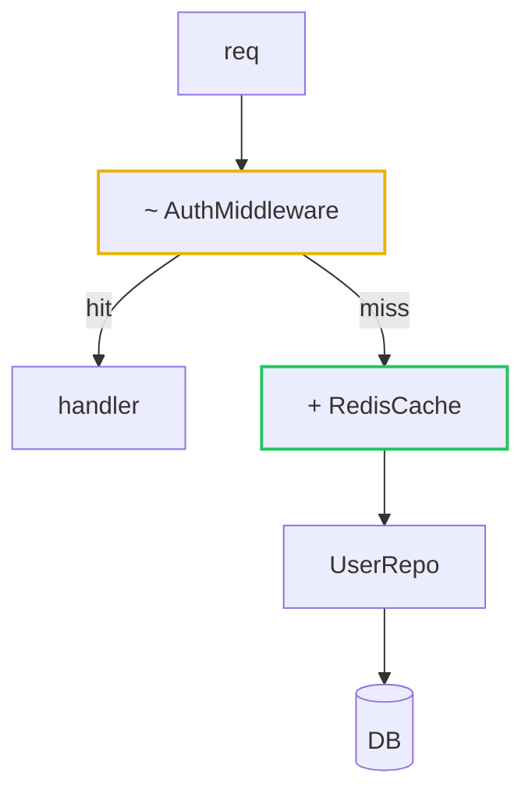

Author a ```mermaid``` diagram of a change's flow/structure. Renders natively on GitHub; preview locally via `:MermaidPreview`.

## Type selection

- `flowchart TD` — control/data flow, job/pipeline structure (default).
- `sequenceDiagram` — ordered interactions between actors/services.
- `stateDiagram-v2` — state machines / lifecycle.
- `erDiagram` — schema/relationship changes.

## When to diagram

Diagram **flow** — control/data moving through the system. If the change is a set of independent edits with no flow between them (config tweaks, added keymaps, renames, new files that don't call each other), a flowchart becomes a cryptic box-inventory: **skip it, describe in prose.** Diagram only the sub-part that has real flow, if any.

Trivial change (1-2 small files, no flow impact) → skip the diagram.

## Core rules

- **Scope to the changed surface** — diagram what the change touches + just enough unchanged context to place it. Not a full-system inventory.
- **Every node carries a descriptive label** — `id["Reads PR diff"]`, never a bare id (`B`) or a single cryptic word. A node a reader can't interpret without the source is a bug.
- **Subgraphs** for grouping (jobs, layers, bounded contexts). Label them.
- **Edge labels: short plain words only** (`-->|cache miss|`, `-->|extracted block|`). Never put `+`/`~`/`-` markers or quotes in an edge label — markers belong on nodes; they break edge-label parsing.
- Keep node labels concise; fuller detail goes in the legend/caption or prose, not crammed into the diagram.

## Delta mode (code review)

When diagramming a changeset (not a static architecture), show the delta narrative, not a component map.

Mark nodes by change kind via `classDef` + label prefix:



- `+ Name` + `:::added` — newly added
- `~ Name` + `:::modified` — modified
- `- Name` + `:::removed` — removed (dashed)
- Unmarked — unchanged context

**Legend (required)** below the diagram — one line **per marked node**, `<marker> Name — what changed / why`. The diagram shows *where*; the legend says *what + why*. NOT a marker-type key (`~ modified, + added` alone is insufficient — node labels are too terse to stand on their own).

```
Changes:
  ~ AuthMiddleware — added cache check before DB lookup
  + RedisCache — token lookup, 5m TTL, falls through to DB on miss
  - LegacyTokenStore — replaced by RedisCache
```

## Architecture mode (PR description)

Static structure of what the change introduces (jobs, services, flow). No delta markers — the diagram shows the resulting system. Use subgraphs for parallel/grouped work and labeled edges for branch conditions.

**Caption (required)** below the diagram — a short prose line or bullet list naming each non-obvious node/subgraph and its role, so the diagram reads standalone:

```
- spec-check job — runs in parallel with AI review, no Bedrock access
- DECIDE — gate: spec present, opt-out label, or all files allowlisted
```
